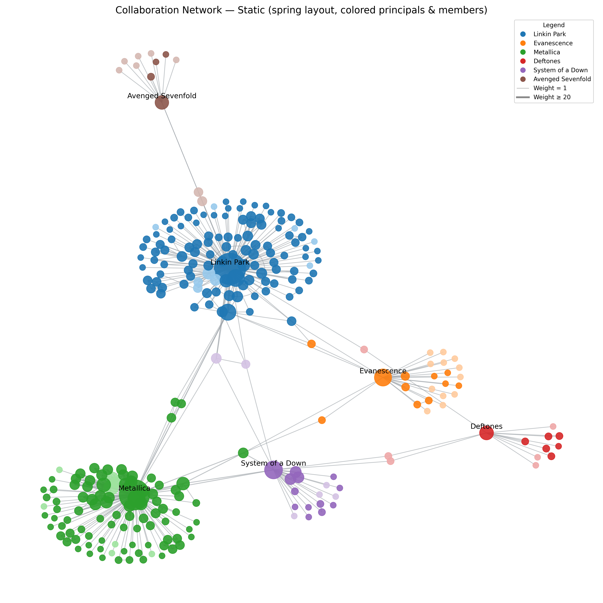

# Music Collaboration Network (MusicBrainz)

This project extracts data from the [MusicBrainz API](https://musicbrainz.org/doc/MusicBrainz_API) to **analyze and visualize collaboration networks** among six seed bands:

- Linkin Park  
- Evanescence  
- Metallica  
- Deftones  
- System of a Down  
- Avenged Sevenfold  

The pipeline builds a network of collaborations, enriching it with metadata (band members, type, country, debut year, etc.) and provides both static and interactive visualizations.

---

## Requirements

- Python **3.10+**
- Internet connection (MusicBrainz API enforces a polite rate-limit of ~1 request/second)
- See `requirements.txt` for full dependency list:
  - `requests`
  - `networkx`
  - `matplotlib`
  - `pyvis`

---

## Installation

1. Clone this repository:
   ```bash
   git clone https://github.com/your-username/your-repo.git
   cd your-repo
2. (Optional) Create and activate a virtual environment:
   # Windows
   ```bash
   py -3 -m venv venv
   venv\Scripts\activate
   ```

   # macOS/Linux
   ```bash
   python3 -m venv venv
   source venv/bin/activate

3. Install the dependencies:
   ```bash
   pip install -r requirements.txt


---

## Usage

Open the notebook MusicBrainz-Collab-Network.ipynb in Jupyter or VS Code.

Run the steps sequentially:

1. Fetch MBIDs for the seed artists.
2. Download recordings and artist credits.
3. Build the full collaboration graph with band members and collaborators.
4. Filter and analyze the graph (weak ties, degree distribution, connectivity).
5. Static and Interactive Visualization
   1. Generate a static graph (results/static_network.png).
   2. Generate an interactive HTML (results/network.html).

Explore results:
- Open results/static_network.png for the static view.
- Open results/network.html in your browser for the interactive network (PyVis).

---

## Results

- Static Visualization:  
    
- Interactivo Visualization:  
  - Open results/network.html in your browser.
  - Tooltips include metadata (type, role, country, debut, notes, collaborations).
  - Physics and interaction controls allow free exploration of the graph.

---

## Project Structure

**/data**  
- `artist_mbids.json` → MBIDs of the seed artists  
- `recordings.json` → All recordings + credits  
- `artist_metadata.json` → Enriched metadata (type, debut, etc.)  

**/results**  
- `static_network.png` → Static visualization (Matplotlib)  
- `network.html` → Interactive visualization (PyVis)  

**Other files**  
- `MusicBrainz-Collab-Network.ipynb` → Main notebook  
- `requirements.txt` → Dependencies  
- `README.md` → Project documentation  

---

## Disclaimer

   This project uses the MusicBrainz API: https://musicbrainz.org/doc/MusicBrainz_API.

   Data is provided under the CC-BY-SA 4.0 License: https://creativecommons.org/licenses/by-sa/4.0/.

   Please respect the MusicBrainz rate-limit (https://musicbrainz.org/doc/MusicBrainz_API/Rate_Limiting) guidelines when running this notebook.

---

## Extensions / Roadmap

- Dynamic edge-weight filtering (interactive slider).
- Timeline animation of collaborations over the years.
- Mini-map for easier navigation in dense graphs.
- Clustering and community detection for automatic grouping.
- Export filtered subgraphs as JSON/CSV for external analysis.
- Advanced metrics (betweenness, closeness, clustering coefficient) in tooltips.
---

## License

MIT License © 2025 Albert Matarín Luque 
